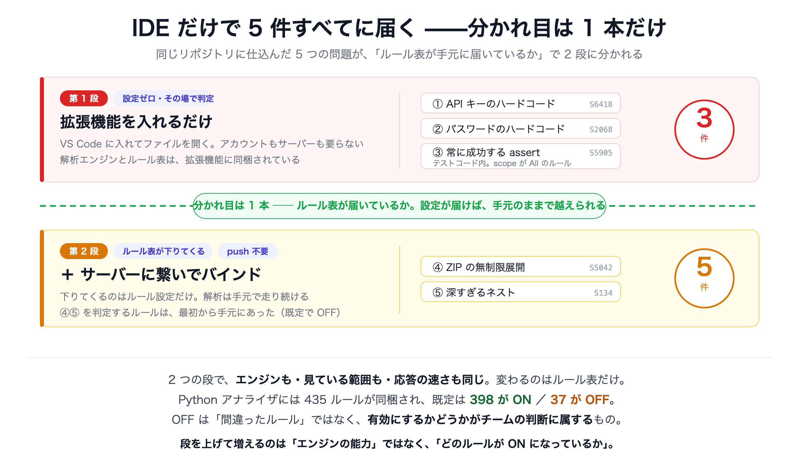

# SonarQube for IDE デモ

**コードを書いているその瞬間に、指摘が出ます。**
コミットも push も CI の完了待ちも要りません。しかもそれが、チーム全員の手元で同じように起きます。

それを VS Code の中だけで確かめるためのリポジトリです。
問題を仕込んだ Python コードが入っていて、標準ライブラリだけで動きます。
クローンして VS Code で開けば、それだけで解析が始まります。

> 図解版（ブラウザで開けます）: [docs/analysis-reach.html](docs/analysis-reach.html)

---

## SonarQube for IDE は何をするものか

VS Code の拡張機能です（旧 SonarLint）。押さえておきたいのは 1 点だけです。

> **解析するプログラムは、拡張機能の中に入っています。**
> サーバーに質問を投げているのではなく、あなたの PC の上で動いています。

だから、拡張機能を入れた瞬間から、ネットワークに出ずに解析が始まります。
入力しながら、その場で赤い波線が引かれます。

- **待ち時間がない。** 送って結果を待つ工程がないので、キーを打つ速度に追いつきます。
- **コードが外に出ない。** ネットワークに繋がっていなくても解析は動きます。
- **全員の手元に同じルール表が入る。** 拡張機能を入れた人は、誰でも同じ基準で指摘を受けます。

指摘が出るのは、**まだ自分しか見ていないコードの上**です。
直すのに一番コストがかからない瞬間に、直すべき場所が分かります。

---

## 動かしてみる

1. VS Code に拡張機能 **SonarQube for IDE**（発行元 SonarSource）を入れる
2. このフォルダを開く
3. `user_manager.py` を開く

以上です。アカウントもサーバーも `pip install` も要りません。
数秒で 2 か所に赤い波線が出ます。`test_user_manager.py` を開くと 3 件目が出ます。

| # | 問題 | ルール | 場所 |
|---|---|---|---|
| 1 | API キーのハードコード | `python:S6418` | [user_manager.py:40](user_manager.py#L40) |
| 2 | パスワードのハードコード | `python:S2068` | [user_manager.py:51](user_manager.py#L51) |
| 3 | いつも成功してしまう assert（テストコード） | `python:S5905` | [test_user_manager.py:108](test_user_manager.py#L108) |

ハードコードされたキーを消して保存すると、波線はその場で消えます。
**「指摘 → 修正 → 消える」が数秒で一周する**——これがこのツールの体験の中心です。

---

## 見どころ：テストが通っているのに、何も守っていない

3 番目がこのデモの中心です。テストコードも同じように解析される、という話でもあります。

```python
assert (result["rank"] == "S", "管理者で高得点なら S になるはず")
```

`assert` は関数ではないので、括弧は引数を囲んだのではなく**タプルを作っています**。
比較そのものは計算されますが、その結果はタプルに詰められた時点で捨てられます。
空でないタプルは常に真なので、**この assert は絶対に失敗しません。**

スキップされたテストなら `skipped` と出るので気づけます。これは違います。
**堂々と PASS します。緑になります。**
試しに `user_manager.py` の `{"rank": "S"}` を `{"rank": "Z"}` に書き換えて実行してみてください。
このテストは落ちません。バグをそのまま通します。

直し方は 2 つです。

```python
# (1) 括弧を 2 文字消す
assert result["rank"] == "S", "管理者で高得点なら S になるはず"

# (2) unittest なら assertEqual に書き換える（関数なので括弧で壊れない）
self.assertEqual(result["rank"], "S", "管理者で高得点なら S になるはず")
```

**このバグは、テストが緑である限り CI もレビューも素通りします。**
気づける場所は、書いているエディタの中しかありません。
SonarQube for IDE は、これを書いているその場で赤い波線にします（Blocker）。

---

## 何が「最低ライン」なのか

入れただけの状態で動いているのは、`Sonar way` という既定のルールセットです。
Python の解析エンジンには 435 個のルールが同梱され、そのうち **398 個が最初から ON** です。

残りの 37 個が OFF なのは、間違ったルールだからではありません。
**直すべきかどうかがチームによって変わる**ものだからです
（ZIP 展開の上限チェックは、社内の信頼できる ZIP しか扱わない現場には厳しすぎることがあります）。

逆に言えば、既定で ON の 398 個は **どのチームでも「これは直すべき」と言えるものだけ**です。
だから何の設定も合意形成もなしに、チーム全員がいきなりこの水準から書き始められます。

---

## 補足：チーム独自の基準を配りたい場合

必須ではありません。「あの 37 個のうちいくつかも見たい」「この指摘は自分たちには要らない」——
そうなったときの話です。

SonarQube サーバーのプロジェクトと紐づける（バインドする）と、
サーバー側で決めたルール表が各自の IDE に降りてきます。
このリポジトリには既定で OFF の 2 件も仕込んであるので、検知が 3 件 → 5 件になります。

| # | 問題 | ルール | 場所 |
|---|---|---|---|
| 4 | ZIP の無制限展開（Zip Bomb） | `python:S5042` | [user_manager.py:78](user_manager.py#L78) |
| 5 | 制御構文のネストが深すぎる | `python:S134` | [user_manager.py:113](user_manager.py#L113) |

よくある誤解は「サーバーが解析してくれるようになった」ですが、**違います。**
解析は相変わらず手元で走っています。増えた 2 件を計算しているのも手元の VS Code です。
サーバーから降りてくるのは **どのルールを ON にするか** という設定だけで、
**判定するルール自体は最初から手元にあった**ので、push もサーバー解析の待ち時間も要りません。

逆向きにも効きます。サーバー側で誰かが「この指摘は対応しない」と決めた項目は、
あなたのエディタからも消えます。

**繋ぐことの価値は「見える件数」ではなく、「全員が同じ基準で見る」ことのほうです。**



---

## もっと詳しく

| ドキュメント | 内容 |
|---|---|
| [docs/analysis-reach.html](docs/analysis-reach.html) | 縦スクロールの図解（ブラウザで開く） |
| [docs/demo-story.md](docs/demo-story.md) | 記事の導入に使う見取り図。図版つき |
| [docs/demo-runbook.md](docs/demo-runbook.md) | 実演手順・撮りどころ・つまずきやすい点 |

### 公式ドキュメント

- [SonarQube for VS Code ドキュメント](https://docs.sonarsource.com/sonarqube-for-vs-code/)
- [Connected Mode のセットアップ](https://docs.sonarsource.com/sonarqube-for-vs-code/connect-your-ide/setup)
- [Python ルール一覧](https://rules.sonarsource.com/python/)

---

## ファイル構成

```
.
├── user_manager.py          デモ対象。【1】【2】【4】【5】を仕込んである
├── test_user_manager.py     テストコード。【3】を仕込んである
├── blog/                    技術ブログ記事（WordPress 貼り付け用）
│   ├── post.html            本文。カスタム HTML ブロックに貼る
│   ├── post-gutenberg.html  本文のブロックマークアップ版（自動生成）
│   ├── to-gutenberg.py      post.html からブロック版を生成する
│   ├── seo.md               貼り付け手順・タイトル案・メタ情報
│   └── faq-schema.html      FAQ 構造化データ（任意）
└── docs/
    ├── analysis-reach.html  縦スクロールの図解
    ├── demo-story.md        記事の見取り図
    ├── demo-runbook.md      実演手順
    └── figures/             図版（SVG と PNG）
```
