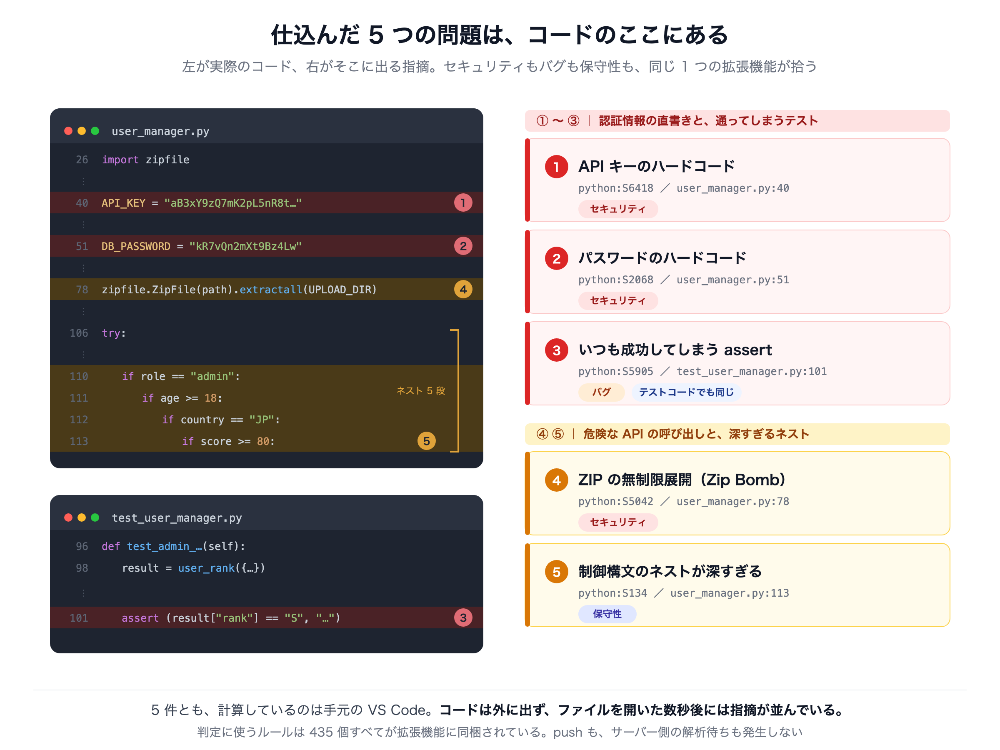
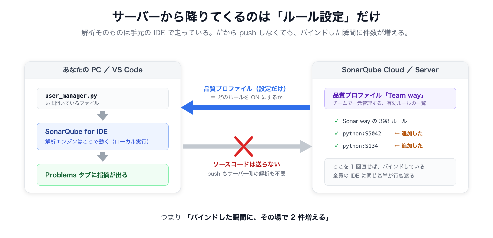
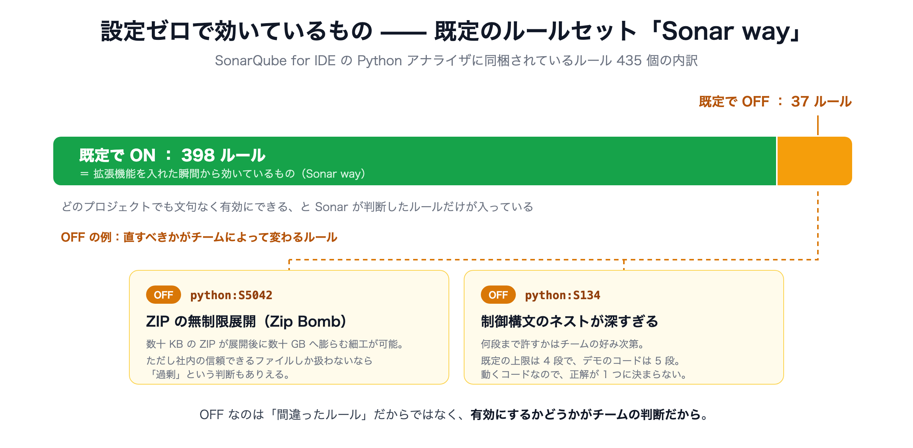
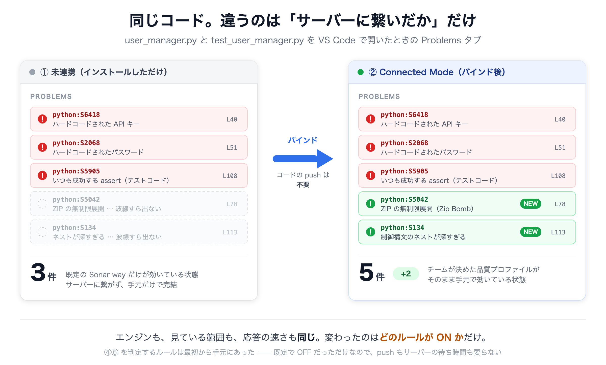

# デモのストーリー（図解）

デモ全体の見取り図です。手順を追う前に、ここで **何を見せたいのか／なぜそれが効くのか** を先に共有します。

図版は [figures/](figures/) に SVG と PNG の両方を置いてあります。
記事には PNG（幅 2400px / Retina 相当）を、資料の編集や高解像度が要る場合は SVG を使ってください。

---

## 0. 結論 —— レビューを待たずに、書いているその場で指摘が出る

このデモで見せたいことは 1 つだけです。

> **チーム全員のエディタが、コードを書いているその瞬間に、同じ基準で同じ指摘を出す。**

SonarQube for IDE は、解析エンジンそのものが VS Code の拡張機能の中に入っています。
サーバーに問い合わせているのではなく、**手元の PC で計算しています**。
だから、入力しているそばから赤い波線が引かれます。

- コミットしなくていい
- push しなくていい
- CI の完了を待たなくていい
- レビューで指摘されるのを待たなくていい

指摘が出るのは、**まだ自分しか見ていないコードの上**です。
直すのに一番コストがかからない瞬間に、直すべき場所が分かります。

そしてこれが「個人の便利ツール」で終わらないのは、
**同じルール表が、拡張機能を入れた全員の手元に等しく入っているから**です。
誰がどのファイルを書いても、最低ラインの解析が同じようにかかります。
「レビュアーによって指摘の厳しさが違う」がなくなる、という話でもあります。

---

## 1. 何が出るのか —— 開くだけで、3 か所に波線が引かれる



実演の入り口はここです。

- 拡張機能 **SonarQube for IDE**（発行元 SonarSource）を入れる
- このフォルダを開く
- [`user_manager.py`](../user_manager.py) を開く

これだけです。アカウントも、サーバーも、`pip install` も要りません。
数秒で 2 か所に赤い波線が出ます。
[`test_user_manager.py`](../test_user_manager.py) を開くと、3 件目が出ます。

| # | 問題 | ルール | 場所 |
|---|---|---|---|
| ① | API キーのハードコード | `python:S6418` | [`user_manager.py:40`](../user_manager.py#L40) |
| ② | パスワードのハードコード | `python:S2068` | [`user_manager.py:51`](../user_manager.py#L51) |
| ③ | いつも成功してしまう assert | `python:S5905` | [`test_user_manager.py:108`](../test_user_manager.py#L108) |

（図の下段にある ④⑤ は既定では出ません。チーム独自の基準の話なので、補足の 5. で触れます）

**その場で直せることまで見せます。**
①のハードコードされたキーを消して保存すると、波線がその場で消えます。
「指摘 → 修正 → 消える」が数秒で一周する。ここがこのツールの体験の中心です。

> 実演のコツ：あらかじめ書いてあるコードを見せるより、
> **その場で `API_KEY = "..."` を 1 行タイプして、打ち終わる前に波線が出る**ほうが伝わります。

---

## 2. なぜ手元だけで完結するのか



ここが一番誤解されやすいところです。

「解析ツール」と聞くと、コードをどこかに送って結果を待つ絵を思い浮かべがちですが、
SonarQube for IDE は違います。**解析するプログラムが拡張機能に同梱されています。**

- **ソースコードは外に出ません。** ネットワークに繋がっていなくても解析は動きます。
- **待ち時間がありません。** 送って待つ工程がないので、キーを打つ速度に追いつきます。
- 後で出てくる Connected Mode（サーバーに繋いだ状態）でも、**コードは送られません。**

つまり、リアルタイムであることと、コードが外に出ないことは、同じ 1 つの事実の裏表です。

---

## 3. 見どころ —— テストが通っているのに、何も守っていない

[`test_user_manager.py`](../test_user_manager.py) の 1 件が、このデモで一番反応があります。

```python
assert (result["rank"] == "S", "管理者で高得点なら S になるはず")
```

```
python:S5905  Fix this assertion on a tuple literal.  (108行目)
```

括弧が作っているのはタプルで、空でないタプルは常に真です。
比較そのものは計算されますが、その結果はタプルに詰められた時点で捨てられます。
つまり **この assert は絶対に失敗しません。**

スキップなら `skipped` と出るので気づけますが、これは**堂々と PASS します。緑になります。**
実演では `user_rank()` の返す `"S"` を `"Z"` に書き換えて走らせ、
**それでもテストが通る**ところを見せます。

直し方は括弧を 2 文字消すか、`self.assertEqual(result["rank"], "S")` に書き換えるかです。
保存すれば、その場で指摘が消えます。

**このパートが効くのは、リアルタイム性の価値が一番はっきり出るからです。**
このバグは、テストが緑である限り CI もレビューも素通りします。
気づける場所は、書いているエディタの中しかありません。

> **なお、このルールの Quick Fix「Remove parentheses」は、
> 要素が 1 個のタプル `assert (x,)` のときだけ提供されます。**
> 今回のような 2 要素の形では電球が出ないので、手で消してください。

---

## 4. 何が「最低ライン」なのか —— `Sonar way`



入れただけの状態で動いているのは、**`Sonar way` という既定のルールセット**です。

Python のアナライザには 435 個のルールが同梱されていて、
そのうち **398 個が最初から ON**、**37 個は OFF** になっています。

OFF なのは、そのルールが間違っているからではありません。
**「直すべきかどうかが、チームによって変わる」ルールだから**です。

- **Zip Bomb（`python:S5042`）** — 外部からアップロードされる ZIP を扱うなら必須ですが、社内の信頼できる ZIP しか読まない環境では過剰になりえます。
- **深いネスト（`python:S134`）** — 何段まで許すかは、チームの好みそのものです。

逆に言えば、既定で ON になっている 398 個は
**どのチームでも「これは直すべき」と言えるものだけ**が選ばれています。
だから、何も設定しないまま配っても、誰の環境でも文句の出ない指摘が出ます。

これが「最低ライン」の中身です。
**チーム全員が、何の合意形成もなしに、いきなりこの水準から書き始められます。**

---

## 5. 補足 —— チーム独自の基準を配りたい場合

ここから先は、必須ではありません。
「うちのチームでは、あの 37 個のうちいくつかも見たい」
「逆に、この指摘は自分たちには要らない」——そうなったときの話です。



SonarQube サーバーのプロジェクトと VS Code を紐づける（バインドする）と、
**サーバー側で決めたルール表が、各自の IDE に降りてきます。**

このリポジトリでは、その様子が見えるように
既定で OFF の 37 個から 2 件を仕込んであります。バインドすると検知が 3 件 → 5 件になります。

| # | 問題 | ルール | 場所 |
|---|---|---|---|
| ④ | ZIP の無制限展開（Zip Bomb） | `python:S5042` | [`user_manager.py:78`](../user_manager.py#L78) |
| ⑤ | 制御構文のネストが深すぎる | `python:S134` | [`user_manager.py:113`](../user_manager.py#L113) |


**ここで強調したいのは、件数が増えたことではありません。**

増えた 2 件を判定しているのも、やはり手元の VS Code です。
④⑤ のルールは最初から拡張機能に入っていて、ON になった瞬間に出ます。
サーバーから降りてきたのは **「どれを ON にするか」という設定だけ** で、
push も、サーバー側の解析待ちも、一度も発生していません。

つまりバインドで変わるのは **エンジンの能力ではなく、ON になっているルールの範囲** です。
同じことは各自が VS Code の設定に書いても実現できます。技術的な壁ではありません。

そのうえで、繋ぐ意味は 2 つあります。

- **全員が同じ基準になる。** 一人ひとりが手元で設定しない限り、チームの決めごとは誰の IDE にも効きません。サーバー側のプロファイルを 1 回直せば、バインドしている全員に行き渡ります。
- **「対応しない」も共有される。** サーバー側で誰かが「この指摘は対応しない」と決めた項目は、各自のエディタからも消えます。同じコードを見て、全員が同じ結論を見ます。

**繋ぐことの価値は「見える件数」ではなく、「全員が同じ基準で見る」ことのほうです。**

---

## 図版の使いどころ

| 図版 | 問い | 答え |
|---|---|---|
| [03-file-map](figures/03-file-map.png) | どこに何がある？ | 2 ファイル・5 か所。すべて手元で計算している |
| [04-connected-mode](figures/04-connected-mode.png) | なぜ即座に出る？ | 解析エンジンが拡張機能の中にある。コードは外に出ない |
| [02-rules](figures/02-rules.png) | 既定では何が見える？ | 435 ルール中 398 個。どのチームでも通用する範囲 |
| [01-overview](figures/01-overview.png) | 何が検知できる？ | セキュリティ・バグ・保守性の 5 件。ブログ冒頭に置く図 |
| [07-connected-compare](figures/07-connected-compare.png) | 繋ぐと何が変わる？（補足） | 同じコードで 3 件 → 5 件 |
| [06-limits](figures/06-limits.png) | 増えた分はどこで計算？（補足） | やはり手元。降りてくるのは設定だけ |

テストコードの話（本文 3.）は専用の図版を持ちませんが、
デモの中では一番時間を取る価値のあるパートです。

### 記事の芯

> **書いた瞬間に、チーム全員のエディタが同じ基準で指摘を返す。**
> 送る先も、待ち時間も、合意形成も要らない。

補足として置いた Connected Mode も、同じ話の延長です。

> 開発者ひとりひとりが手元で設定しない限り、チームの基準は誰の IDE にも効かない。

繋ぐと、その設定作業がゼロになります。しかもコードは一切外に出ません。

---

## 図版の再生成

SVG を編集したあと、PNG を作り直す場合：

```bash
cd docs/figures
for f in 00-eyecatch:1200:630 01-overview:1200:800 02-rules:1200:590 03-file-map:1200:900 04-connected-mode:1200:580 05-sharing:1200:640 06-limits:1200:700 07-connected-compare:1200:724; do
  n=${f%%:*}; rest=${f#*:}; w=${rest%%:*}; h=${rest#*:}
  "/Applications/Google Chrome.app/Contents/MacOS/Google Chrome" \
    --headless --disable-gpu --hide-scrollbars --force-device-scale-factor=2 \
    --screenshot="$n.png" --window-size=$w,$h "file://$PWD/$n.svg"
done
```

フォントは macOS 標準の Hiragino Sans を前提にしています。
別環境で生成すると字面が変わるので、PNG は同じ環境で作り直してください。
